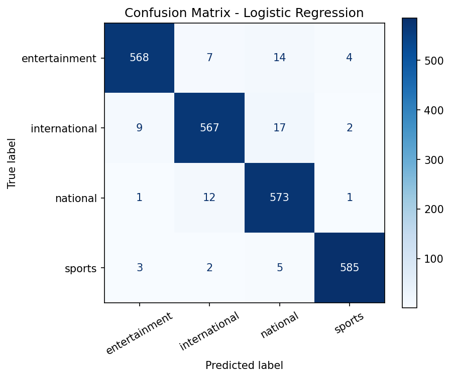

# 📰 Bangla News Category Classifier

A Bangla NLP project that classifies news articles into four categories: **sports, national, international, entertainment**. Built with TF-IDF and classical machine learning, and deployed as a Streamlit web app.

🔗 **Live demo:** _(add your Streamlit link here)_

## Results

Test set: 2,370 articles (20% stratified hold-out).

| Model | Accuracy | Macro-F1 |
|---|---|---|
| Naive Bayes | 95.74% | 95.74% |
| **Logistic Regression** (selected) | **96.75%** | **96.75%** |
| Linear SVM (calibrated) | 96.75% | 96.75% |

Per-class F1 for the selected model: sports 0.986, entertainment 0.968, international 0.959, national 0.958.



**Error analysis:** most mistakes are between *national* and *international* (and *entertainment* → *national*). This is expected: stories about Bangladesh's foreign relations, or celebrities in the news for non-entertainment reasons, sit on the boundary between categories.

## What the model learned
Top words per category (from Logistic Regression coefficients): sports → ক্রিকেট, ম্যাচ, ফুটবল; entertainment → অভিনেতা, সিনেমা, বলিউড; international → প্রেসিডেন্ট, ইসরায়েলি, মার্কিন; national → রাজধানীর, ঢাকা, সরকার. The words match human intuition, which is a good sanity check that the model is not relying on noise.

## Approach
1. **Data:** 11,904 Bangla news articles, 4 balanced classes. After removing empty and duplicate articles: 11,849.
2. **Cleaning:** removed URLs, English characters, digits and punctuation; kept only Bangla Unicode letters.
3. **Features:** TF-IDF on title + content, unigrams and bigrams, 150k max features, sublinear TF.
4. **Tokenization note:** scikit-learn's default token pattern splits Bangla words at vowel signs (matra), so I use whitespace tokenization after cleaning.
5. **Models:** Naive Bayes, Logistic Regression, Linear SVM compared on macro-F1.
6. **Duplicates removed before splitting** to avoid train/test leakage.

## Run locally
```bash
pip install -r requirements.txt
python train.py --data data/Bangla_news.csv   # trains, saves model + metrics
streamlit run app.py
```
Place the dataset CSV (columns: `title`, `content`, `category`) in `data/`.

## Limitations & next steps
- Accuracy is measured on one split of one news source; other outlets or writing styles may score lower.
- TF-IDF ignores word order and context. Next step: fine-tune BanglaBERT and compare.
- Only four coarse categories; no "politics" or "business" split yet.

## Tech
Python, pandas, scikit-learn, Streamlit, joblib
